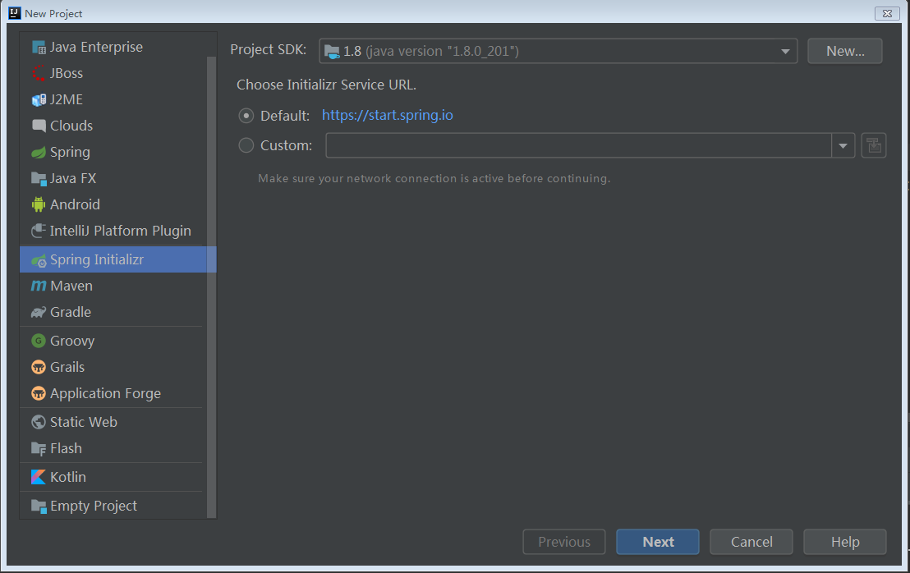
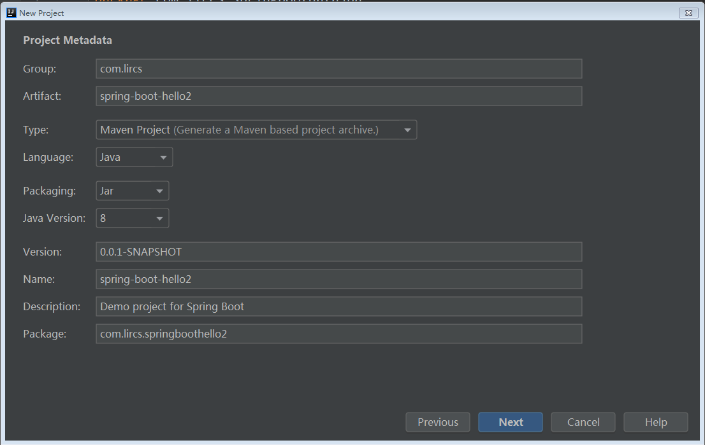
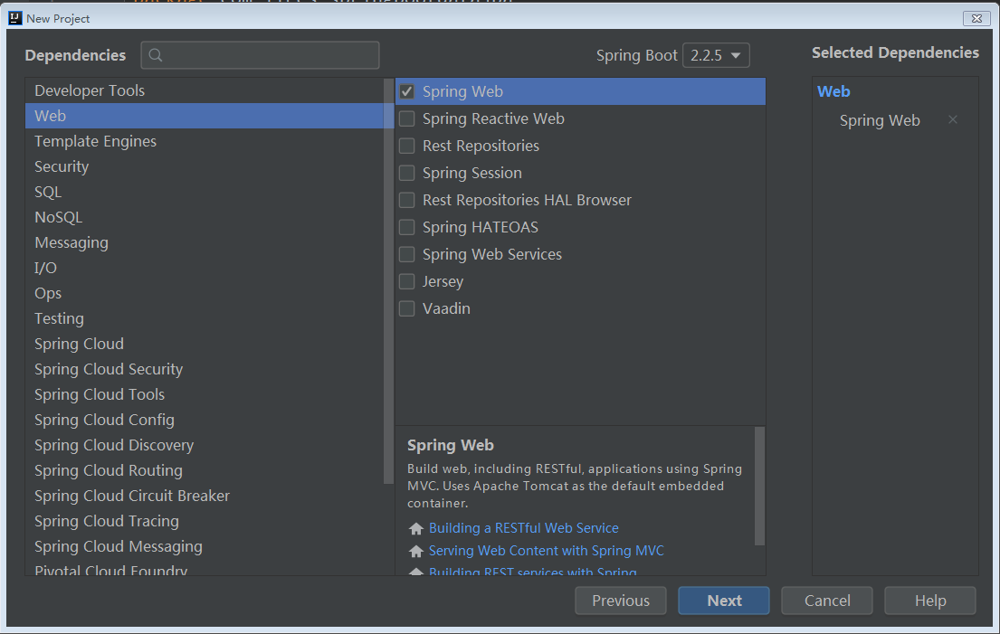
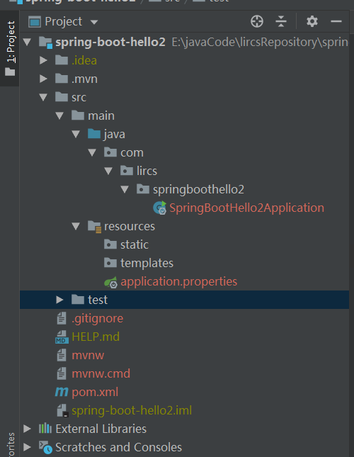
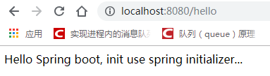

[Spring boot 入门工程（一）](../spring-boot-hello\spring-boot-hello.md) 介绍了如何自己动手创建一个 Spring boot 工程，我们首先创建了一个 maven 工程，然后引入所需要的相关依赖包，然后，再编写了 HelloControoler 控制器，并标示了主类。

这篇文章的话，我们依然会创建一个 Spring boot 工程，我们不会再手动引入依赖包，因为我们使用了 Spring Initializer。它会帮我们引入所需要的依赖包，下面我们就演示下：

# 1. 创建初始化工程

选择 Spring Initializer。然后，点击 Next。



填好 Group，Artifact ，并选择好工程类型，打包方式，Java 版本号等信息，然后进入下一步。



下面这一步非常，关键，大家可以看到，它上面有很多 Spring boot 的初始化器，对应不同的应用场景，当然，这篇文章里，我们不用一个个去了解它的详细功能，现在，我们只需要选择 Web -> Spring Web 就可以了。



接着，我们在下一步选择下项目和存储路径，然后完成配置，进入项目等待 maven 也我们自己导入相关的依赖包。

# 2. 查看项目结构

完成以后，我们可以看一下，项目的结构，可以和[Spring boot 入门工程（一）](../spring-boot-hello\spring-boot-hello.md)对比一下差异。可以看到，这个工程里多了一个 resources 目录，test 目录，这些目录的作用，我们会在后面的学习中慢慢的讲到，现在可以暂时不用管。



我们主要看看`pom.xml`文件，

```xml
    <parent>
        <groupId>org.springframework.boot</groupId>
        <artifactId>spring-boot-starter-parent</artifactId>
        <version>2.2.5.RELEASE</version>
        <relativePath/> <!-- lookup parent from repository -->
    </parent>
    <groupId>com.lircs</groupId>
    <artifactId>spring-boot-hello2</artifactId>
    <version>0.0.1-SNAPSHOT</version>
    <name>spring-boot-hello2</name>
    <description>Demo project for Spring Boot</description>

    <properties>
        <java.version>1.8</java.version>
    </properties>

    <dependencies>
        <dependency>
            <groupId>org.springframework.boot</groupId>
            <artifactId>spring-boot-starter-web</artifactId>
        </dependency>

        <dependency>
            <groupId>org.springframework.boot</groupId>
            <artifactId>spring-boot-starter-test</artifactId>
            <scope>test</scope>
            <exclusions>
                <exclusion>
                    <groupId>org.junit.vintage</groupId>
                    <artifactId>junit-vintage-engine</artifactId>
                </exclusion>
            </exclusions>
        </dependency>
    </dependencies>
```

我们可以看到，这个包里**已经自动包含**了`spring-boot-starter-web`和`spring-boot-starter-parent`这两个依赖包，当我们在创建工程时选择了 Web -> Srping Web 依赖以后，初始化器会为我们自动引入相关启动器，就不用我们自己一个依赖，一个依赖的引入，是不是很方便啊。这就是 Spring boot 的宗旨，可以让我们省去很多配置的工作，从而把精力都放在编写程序，比如说下面的 `HelloController`。

# 3. 编写控制器，并运行测试

在 `springboothello2` 目录下，新建 `controller.HelloController.java` 类。然后编写控制器。

```java
@RestController
public class HelloController {
    @RequestMapping("/hello")
    public String hello() {
        return "Hello Spring boot, init use spring initializer...";
    }
}
```

可以看到，我们这个编写和上次写的有点不太一样，这次我们只用了一个注解 `@RestController`，没有使用`@Controller`注解，在 hello 方法上也没有使用`@ResponseBody`注解。为什么呢？因为它们的作用是一样的。都可以直接返回 json 数据。

接下来，我们测试一下，如下，我们请求以后可以返回我们在控制器中定义的数据，则表示我们程序 ok，可以上线了。哈哈。



# 4. 完整代码

- **github: ** [https://github.com/lircs/lircsRepository/tree/master/2020/03/spring-boot-hello2](https://github.com/lircs/lircsRepository/tree/master/2020/03/spring-boot-hello2)
- **gitee: ** https://gitee.com/lircs/lircsRepository/tree/master/2020/03/spring-boot-hello2](https://gitee.com/lircs/lircsRepository/tree/master/2020/03/spring-boot-hello2)