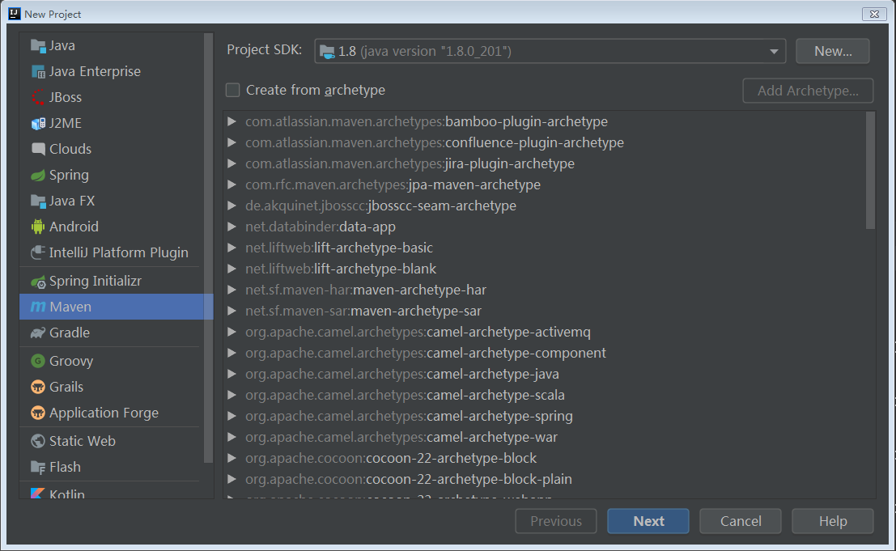
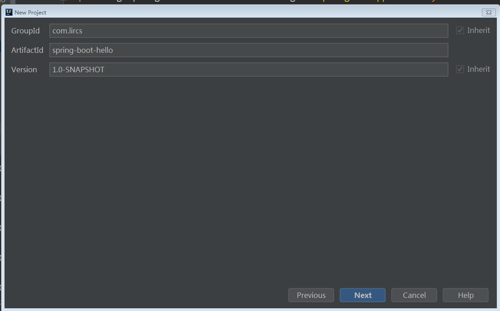
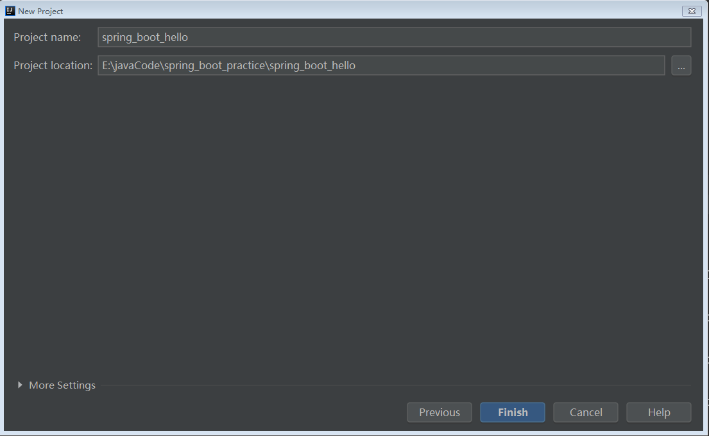
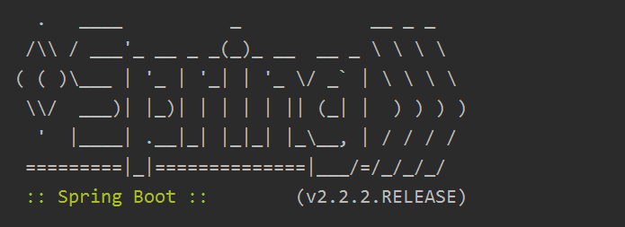

本工程主要演示自己手动创建一个 Springboot 工程，后续我们还可以通过其它方法来创建，比如可以通过spring.io 网站，也可以通过 idea 的 Spring Initializr 创建。不过，说到底也都通过 [spring.io](spring.io) 实现的。

# 1. 建立工程







# 2. 配置工程

## 2.1 配置 pom.xml 文件

```xml
    <parent>
        <groupId>org.springframework.boot</groupId>
        <artifactId>spring-boot-starter-parent</artifactId>
        <version>2.2.2.RELEASE</version>
    </parent>

    <dependencies>
        <dependency>
            <groupId>org.springframework.boot</groupId>
            <artifactId>spring-boot-starter-web</artifactId>
        </dependency>
    </dependencies>
```

## 2.2 编写控制器

```java
package com.lircs.springboot.controller;

import org.springframework.stereotype.Controller;
import org.springframework.web.bind.annotation.RequestMapping;
import org.springframework.web.bind.annotation.ResponseBody;

@Controller
public class HelloController {
    @ResponseBody
    @RequestMapping("hello")
    public String hello() {
        return "Hello Spring boot...";
    }
}
```

## 2.3 编写主类

```java
package com.lircs.springboot;

import org.springframework.boot.SpringApplication;
import org.springframework.boot.autoconfigure.SpringBootApplication;

@SpringBootApplication
public class SpringbootMainApplication {
    public static void main(String[] args) {
        SpringApplication.run(SpringbootMainApplication.class, args);
    }
}
```

# 3. 运行结果

当你看到如下的运行结果时，表示运行成功。



通过浏览器来测试程序。

